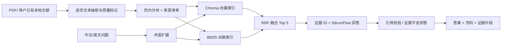

# GeoChem-RAG 项目设计草案

更新时间：2026-09-28。状态：规划稿，尚未开发。

## 1. 产品定位

面向岩石地球化学科研阅读的证据型问答。目标用户提问如“某论文如何解释埃达克质岩石的成因？”或“该文对 MORB 与岛弧玄武岩的判别依据是什么？”，系统返回简洁回答、可点击的论文和 PDF 页码、支持答案的短证据片段。跨中文问题与英文文献的检索是第一版的重要场景。

第一版的区分点是**来源可追溯和可量化验证**，不靠堆叠“Agentic RAG”名词。语料直接来自用户放在 `PDF/` 的现有文件，不由 Agent 在线下载。`PDF/` 默认私有；公开仓库的演示材料仅从用户明确确认可再分发的本地文件中挑选，否则使用自建测试样例。教材和博士项目资料不进入公开仓库。

## 2. 备选方案与选择

| 路线 | 优点 | 代价 | 结论 |
| --- | --- | --- | --- |
| LlamaIndex 一体化管线 | 快速接通解析、索引、问答 | 抽象层较多，页码与引文校验容易藏在框架内 | 以后可加适配器 |
| 小型自有管线：pypdf + Chroma + BM25 + SiliconFlow | 每一步可测试，面试中能解释检索和证据链 | 需要自己维护少量胶水代码 | **第一版采用** |
| MinerU + 多模态表格 + 自主 Agent | 可覆盖复杂图表 | 依赖、成本和错误面显著增加 | 第二、三阶段再评估 |

技术选择是当前设计假设，实施前验证可用模型 ID、版本和价格。SiliconFlow 的 API 地址采用 `https://api.siliconflow.cn/v1`，对话、向量和重排模型都由配置指定，不把某个可能下线的模型写死在代码里。官方文档：[对话 API](https://docs.siliconflow.cn/docs/api/chat-completions-post)、[重排 API](https://docs.siliconflow.cn/docs/api/rerank-post)、[更新公告](https://docs.siliconflow.cn/docs/release-notes/overview)。

## 3. 第一版能力边界

### 必做

1. 导入可提取文本的 PDF；逐页提取、标记质量、在同一页内分块，保留源文件 SHA-256、PDF 页序号和段落文本。扫描件或抽取失败页显式标记，不能无声丢失。
2. 实现向量检索与 BM25 词面检索，使用简单的倒数排序融合（RRF）；保留 dense-only 基线以便做消融实验。地质缩写词典只作透明的同义词扩展，记录扩展后的查询。
3. 检索结果先作为带 ID 的证据交给 LLM；LLM 只引用证据 ID。后处理把 ID 映射成 `论文标题，PDF 第 N 页`，拒绝不存在或不在本次证据集的引用。证据不足时返回拒答状态。
4. Streamlit 页面展示问题、答案、引用、证据片段、PDF 打开入口以及当前模型和检索配置。
5. 固定人工标注评估集与脚本；分别衡量 Recall@5、引用正确率、支持性、不可回答问题的拒答率和延迟/费用。报告每题结果及失败案例。

### 第一版暂缓

复杂表格单元格定位、OCR、图像和判别图理解；CSV 地化数据库；Mg# 等地化计算；模型生成代码执行；ReAct 多轮自主规划；Ragas 作为唯一质量指标；Docker 部署和云端托管。后续阶段是否增加，以第一版错误分析决定。

## 4. 数据流与模块契约

建议的跨模块字段（真正写代码时可用 `dataclass` 或 Pydantic，但字段语义不得变）：

| 对象 | 必备字段 | 约束 |
| --- | --- | --- |
| `Source` | `source_id`, `title`, `title_is_filename`, `authors`, `year`, `doi_or_url`, `license`, `license_url`, `sha256`, `visibility` | `visibility` 为 `public` 或 `private`；0.2.0 契约允许私有来源的未知作者/年份/DOI/许可证为空；`title_is_filename` 标记临时标题；公开来源仍需许可证明 |
| `EvidenceChunk` | `chunk_id`, `source_id`, `pdf_page`, `text`, `section`, `quality` | `pdf_page` 从 1 开始；块不得跨页；ID 在重复导入时稳定 |
| `SearchHit` | `chunk_id`, `score`, `rank`, `retrievers` | 可追溯排序分数与来源 |
| `Answer` | `status`, `text`, `citations`, `evidence` | `status` 为 `answered` / `insufficient_evidence` / `error`；引用必须属于本次证据 |

一个来源更新后按 SHA-256 重新入库；同一 SHA-256 重复导入不增加重复块。删除来源时同步清理索引。原 PDF、抽取文本、向量库都放在本地忽略目录；公开仓库只提交经许可审查的演示样本与许可清单。

## 5. 评估与演示

先从用户指定的本地文献子集中人工编写并审核 40 个问题：术语/缩写 10、跨语言检索 10、跨文献比较 10、不可回答或证据冲突 10。每题记录期望 source ID、PDF 页码、参考答案要点和是否应拒答。私有语料的题目、答案和评估结果默认只在本地保存；公开评估集需使用用户确认可公开的材料或自建测试样例。

指标口径：Recall@5 以可回答题的人工标注 `source_id + pdf_page` 为相关集合，计算 Top 5 命中的相关页对数 / 全部相关页对数；引用正确率为人工核对确实支持对应答案要点的引用数 / 所有显示的引用数；拒答率为应拒答题中返回 `insufficient_evidence` 的题数 / 应拒答题总数。若一句话含多个独立事实，人工支持性核查按事实拆开计数，并公开分子/分母。

第一版验收目标（目标值，**不是现有成绩**）：Recall@5 ≥ 0.80、引用正确率 ≥ 0.90、应拒答题的拒答率 ≥ 0.80。回答支持性由人工复核至少 40 题并报告分子/分母。若未达标，照实发布基线、错误归因和改进。Ragas Faithfulness/Answer Relevancy 可以作为补充实验，须注明评估模型、语言适配、成本和版本；不能把它当作真实地学正确性的替代。参见 [Ragas 指标概览](https://docs.ragas.io/en/stable/concepts/metrics/overview/)。

演示脚本固定三题：一题英文论文的中文提问，一题地学缩写，一题语料没有答案的问题。录屏中要展示引用点击到 PDF 页及证据片段。README 中的所有“提升 X%”和简历量化表述必须由同一评估集、相同语料、相同模型条件的对照实验生成。

## 6. 本地数据与隐私

只处理用户已放在 `PDF/` 或以后放进 `data/private/` 的文件。Agent 不在线搜索、下载或抓取文献。`PDF/` 整体排除 Git；书籍、论文和博士项目资料默认私有。公开演示需要用户明确指定本地可再分发文件并记录许可依据；如果尚无此类文件，先用自建的小型测试样例验证代码，不把私有 PDF 或其中的长段原文提交仓库。

发送给 SiliconFlow 的是命中的证据片段和问题。对私有知识库启用在线问答前，界面要明确提示这个数据流；若用户以后要求完全本地处理，应另行设计本地 LLM/Embedding 模式。

## 7. 里程碑

- **M0：资料和接口**：清点 `PDF/` 本地文件、选择试验子集、数据契约、人工评估题草案。
- **M1：可追溯问答**：本地 PDF 导入、索引、问答、页码引用与拒答端到端运行。
- **M2：检索实验**：dense-only 对照混合检索，报告每题结果；按错误分析决定是否加 reranker。
- **M3：展示**：Streamlit、可重复 Quick Start、GIF/录屏、架构图、实测简历描述。
- **后续可选**：表格定位与数值 QA；只读、白名单地化计算器（须明确公式、单位和 Fe2+/全铁约定）；复杂 PDF 解析。
